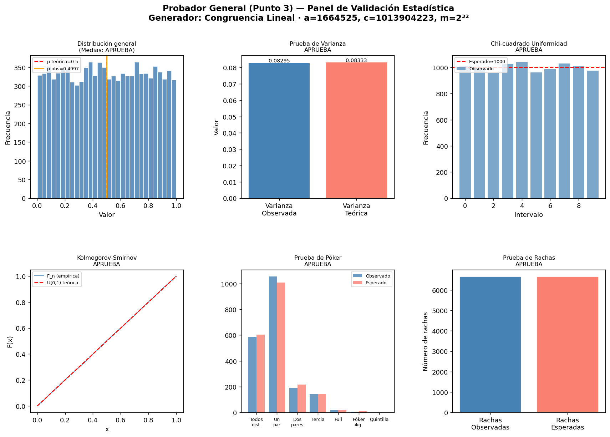
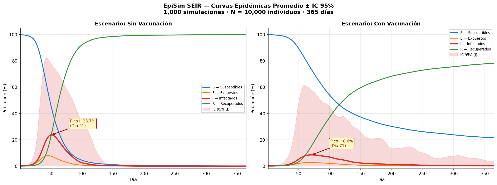
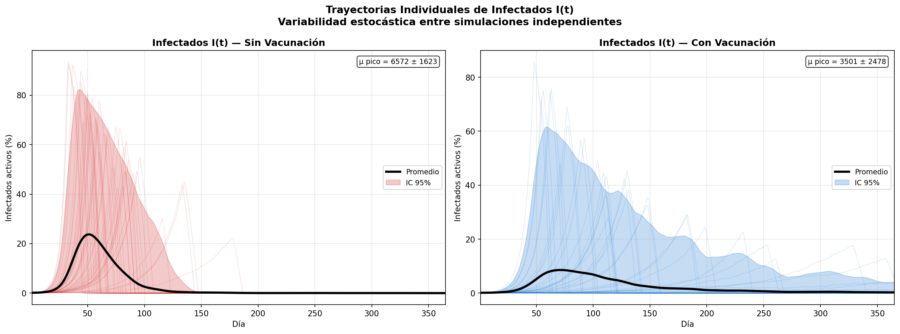
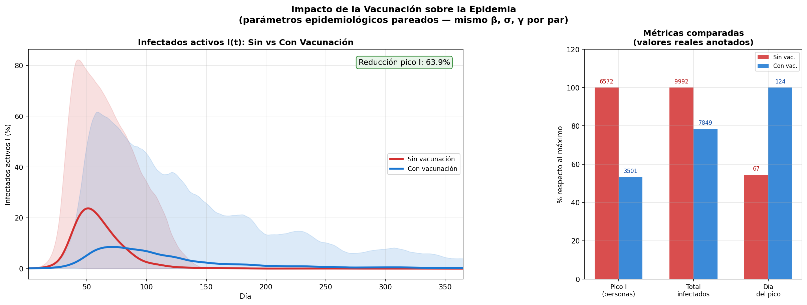
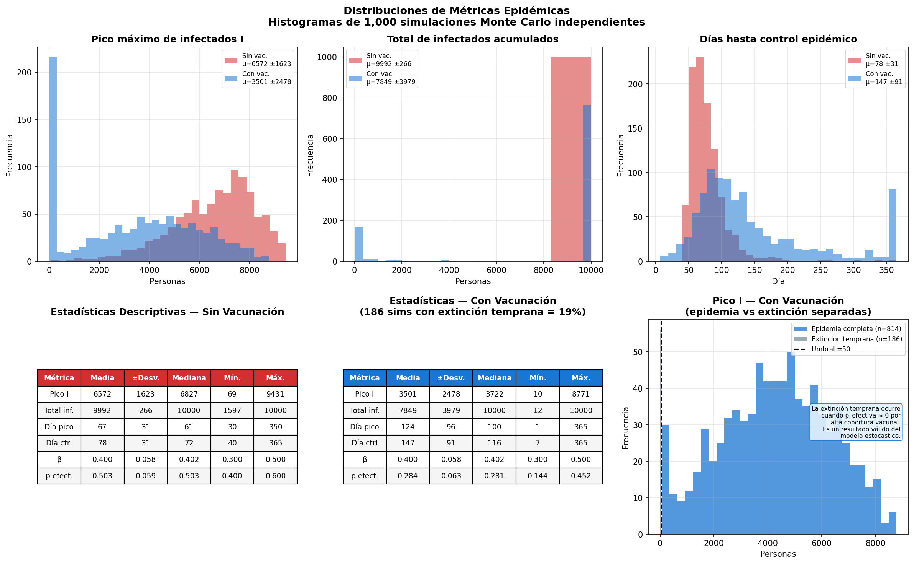
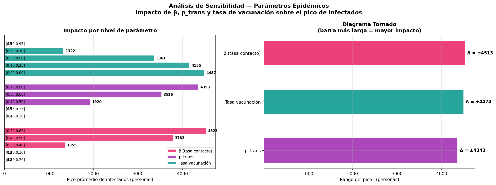
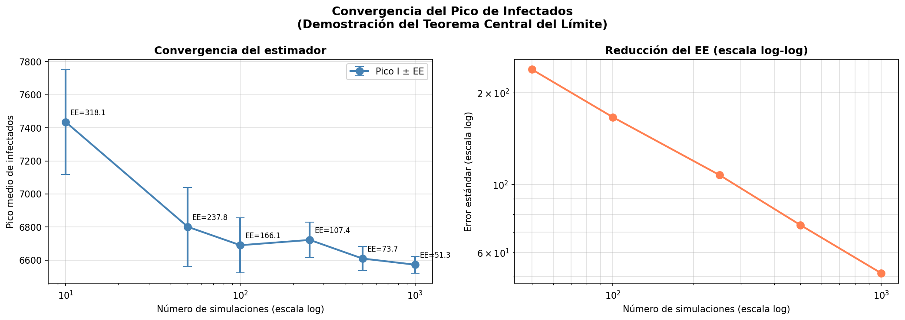
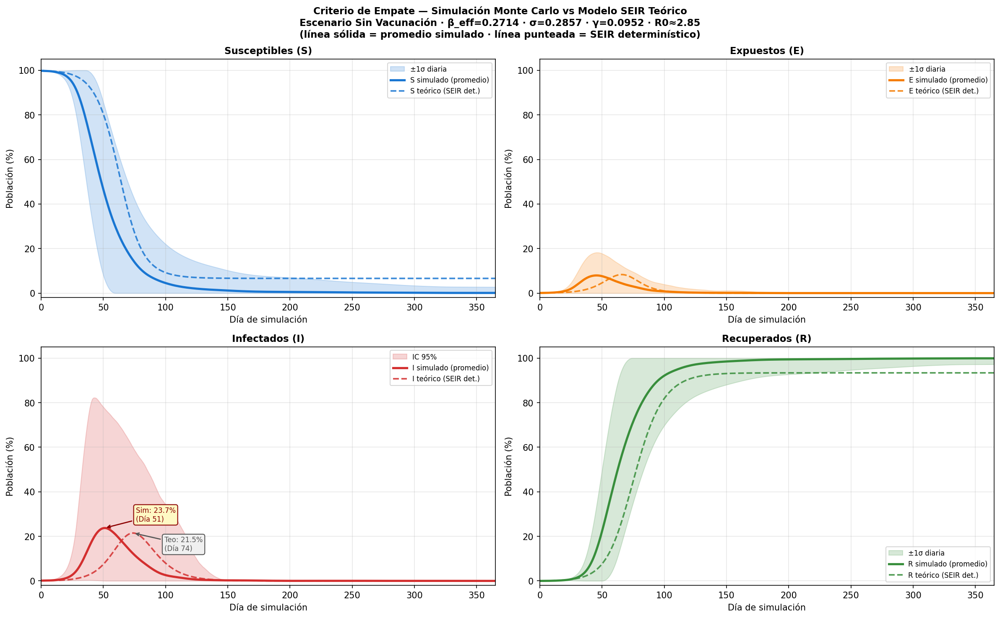

# EpiSim — Simulación Monte Carlo de Propagación de Enfermedades Contagiosas

**Universidad Pedagógica y Tecnológica de Colombia**  
Ingeniería de Sistemas y Computación — Simulación de Computadores 

---

## Tabla de contenido

1. [Descripción general](#1-descripción-general)
2. [Fundamento teórico](#2-fundamento-teórico)
   - 2.1 [El modelo SEIR](#21-el-modelo-seir)
   - 2.2 [De determinístico a estocástico](#22-de-determinístico-a-estocástico)
   - 2.3 [Números pseudoaleatorios y la Matriz s,x](#23-números-pseudoaleatorios-y-la-matriz-sx)
   - 2.4 [El Probador General](#24-el-probador-general)
   - 2.5 [Monte Carlo y convergencia](#25-monte-carlo-y-convergencia)
3. [Parámetros del modelo](#3-parámetros-del-modelo)
4. [Mecánica estocástica paso a paso](#4-mecánica-estocástica-paso-a-paso)
5. [Arquitectura del proyecto](#5-arquitectura-del-proyecto)
6. [Precondiciones e instalación](#6-precondiciones-e-instalación)
7. [Cómo ejecutar](#7-cómo-ejecutar)
8. [Configuración externa de parámetros](#8-configuración-externa-de-parámetros)
9. [Resultados esperados](#9-resultados-esperados)
10. [Validación del modelo](#10-validación-del-modelo)
11. [Decisiones de diseño y justificaciones](#11-decisiones-de-diseño-y-justificaciones)
12. [Limitaciones y trabajo futuro](#12-limitaciones-y-trabajo-futuro)
13. [Referencias](#13-referencias)

---

## 1. Descripción general

EpiSim es una implementación de simulación Monte Carlo del modelo SEIR (*Susceptible-Exposed-Infectious-Recovered*) para el estudio de la dinámica de propagación de enfermedades infecciosas en poblaciones finitas. El proyecto modela el proceso de contagio como un fenómeno inherentemente estocástico: cada contacto, cada decisión de transmisión y cada parámetro epidemiológico se genera mediante números pseudoaleatorios validados estadísticamente.

El objetivo central no es predecir una epidemia específica, sino construir un motor de simulación que permita:

- Estimar distribuciones de métricas epidémicas (pico de infectados, día del pico, total de casos) a partir de 1.000 simulaciones independientes.
- Cuantificar el impacto de la vacunación comparando escenarios pareados con exactamente los mismos parámetros epidemiológicos base.
- Identificar qué parámetros tienen mayor influencia sobre el desarrollo de la epidemia mediante análisis de sensibilidad.
- Validar empíricamente el modelo comparando sus curvas promedio contra el SEIR determinístico de la literatura.

---

## 2. Fundamento teórico

### 2.1 El modelo SEIR

El modelo SEIR es una extensión del modelo SIR clásico de Kermack y McKendrick (1927) que incorpora un compartimento *Expuesto* para representar el período de incubación — el tiempo entre que un individuo se infecta y se vuelve contagioso. La población total N se conserva en todo momento:

```
N = S(t) + E(t) + I(t) + R(t)
```

Las ecuaciones diferenciales del modelo determinístico continuo son:

```
dS/dt = -β · S · I / N
dE/dt =  β · S · I / N  -  σ · E
dI/dt =  σ · E  -  γ · I
dR/dt =  γ · I
```

Donde:
- **β** (beta): tasa de contacto efectivo. Representa el número promedio de contactos infecciosos por unidad de tiempo.
- **σ** (sigma): tasa de progresión E→I. Su inversa σ⁻¹ es el período de incubación en días.
- **γ** (gamma): tasa de recuperación. Su inversa γ⁻¹ es el período infeccioso en días.

El número reproductivo básico R₀ = β/γ determina el comportamiento cualitativo: si R₀ > 1 la epidemia se propaga; si R₀ < 1 se extingue. Para los parámetros medios del modelo (β_eff ≈ 0.2714, γ ≈ 0.0952):

```
R₀ = β_eff / γ ≈ 0.2714 / 0.0952 ≈ 2.85
```

Este valor es coherente con enfermedades respiratorias moderadas como influenza estacional.

### 2.2 De determinístico a estocástico

El modelo determinístico asume que la población es infinitamente grande y homogéneamente mezclada, y que los parámetros son constantes. Estas suposiciones son convenientes matemáticamente pero alejadas de la realidad:

1. **Las poblaciones son finitas**: con N = 10.000 individuos, los efectos estocásticos son significativos.
2. **Los parámetros varían**: β, σ⁻¹, γ⁻¹ y p varían entre individuos, entre cepas y entre contextos sociales.
3. **El contagio es discreto**: una persona específica contacta a otra persona específica; no ocurre una fracción de contagio.

EpiSim resuelve esto mediante un modelo de agentes simplificado donde cada evento (contacto, transmisión, progresión de estado) se decide individualmente usando números pseudoaleatorios U(0,1). Los parámetros se sortean de distribuciones uniformes en cada simulación, generando heterogeneidad entre corridas.

### 2.3 Números pseudoaleatorios y la Matriz s,x

Todo el proceso estocástico del modelo descansa en una secuencia de números pseudoaleatorios U(0,1) generada mediante el **Generador Congruencial Lineal** (LCG, *Linear Congruential Generator*):

```
X_{n+1} = (a · X_n + c) mod m
u_n      = X_n / m
```

Con parámetros:

| Parámetro | Valor | Justificación |
|-----------|-------|---------------|
| a (multiplicador) | 1.664.525 | Numerical Recipes in C (Press et al., 1992) |
| c (incremento) | 1.013.904.223 | Numerical Recipes in C |
| m (módulo) | 2³² = 4.294.967.296 | Período completo garantizado |
| Semilla (s₀) | 2024 | Documentada en la Matriz s,x |

El período completo del generador es m = 2³² ≈ 4.3 × 10⁹, lo que supera ampliamente los ~240 millones de números que consume una ejecución completa de 1.000 simulaciones.

La **Matriz s,x** documenta el estado completo del generador: la semilla inicial s, los parámetros a/c/m, el conteo total de números producidos, el último valor x_n generado, y los primeros diez valores de la secuencia. Con esta información cualquier resultado es perfectamente reproducible.

### 2.4 El Probador General

Antes de usar la secuencia en la simulación, se somete a seis pruebas estadísticas que verifican que los números son efectivamente uniformes e independientes:

| Prueba | Hipótesis nula H₀ | Estadístico |
|--------|-------------------|-------------|
| Medias | μ = 0.5 | Z = (x̄ - 0.5) / (1/√12n) |
| Varianza | σ² = 1/12 | χ² = (n-1)s²/σ²₀ |
| Chi-cuadrado | Distribución uniforme | χ² = Σ(O_i - E_i)²/E_i |
| Kolmogorov-Smirnov | F_n(x) = x para todo x | D = max|F_n(x) - x| |
| Póker | Patrones de dígitos uniformes | χ² sobre frecuencias de manos |
| Rachas | Independencia secuencial | Z = (R - μ_R) / σ_R |

Todas las pruebas se ejecutan con α = 0.05. El modelo solo continúa si el generador supera el Probador General — de lo contrario emite una advertencia. El LCG con los parámetros de Numerical Recipes supera sistemáticamente las seis pruebas.

### 2.5 Monte Carlo y convergencia

El método Monte Carlo consiste en estimar propiedades de un sistema ejecutando muchas simulaciones independientes con diferentes realizaciones de los parámetros aleatorios. Por el Teorema Central del Límite, el error estándar del estimador de la media decrece como:

```
EE = σ / √n
```

Donde σ es la desviación estándar de la métrica y n es el número de simulaciones. Con n = 1.000 simulaciones el error estándar se estabiliza en un valor suficientemente pequeño para obtener estimaciones confiables. La gráfica de convergencia (archivo `07_convergencia.png`) demuestra empíricamente este comportamiento mostrando cómo EE decrece al aumentar n.

---

## 3. Parámetros del modelo

| Parámetro | Símbolo | Distribución | Descripción |
|-----------|---------|--------------|-------------|
| Población | N | Fijo: 10.000 | Individuos en la simulación |
| Infectados iniciales | I₀ | Fijo: 10 | Casos índice al inicio |
| Tasa de contacto | β | U(0.3, 0.5) | Contactos infecciosos por día |
| Período de incubación | σ⁻¹ | U(2, 5) días | Tiempo en estado E |
| Período infeccioso | γ⁻¹ | U(7, 14) días | Tiempo en estado I |
| Prob. transmisión | p | U(0.4, 0.6) | Prob. de contagio por contacto |
| Tasa de vacunación | v | U(0.3, 0.7) | Proporción vacunada |
| Efectividad vacuna | e | U(0.80, 0.95) | Reducción de susceptibilidad |
| Factor de escala | C_MAX | Fijo: 5 | Escala para cálculo de contactos |

Cada parámetro con distribución U(a,b) se genera mediante transformación del LCG:

```
parámetro = a + (b - a) · u_i
```

Donde u_i es el siguiente número del pool global.

---

## 4. Mecánica estocástica paso a paso

Cada día de la simulación, para cada individuo en estado I, se ejecutan tres pasos:

### Paso 1 — Generación estocástica de contactos

```
r_contactos ~ U(0,1)   [consume un número del pool]
n_contactos = piso(r_contactos × C_MAX × β_i)
```

Con C_MAX = 5 y β_i ~ U(0.3, 0.5), el valor esperado de contactos por infectado por día es:

```
E[n_contactos] = C_MAX × E[β] × E[r] = 5 × 0.4 × 0.5 = 1.0
```

### Paso 2 — Selección estocástica de susceptible

```
r_seleccion ~ U(0,1)   [consume un número del pool]
índice = piso(r_seleccion × S_actual)
```

En un modelo bien mezclado todos los S individuos son igualmente accesibles, por lo que el índice seleccionado es epidemiológicamente equivalente a cualquier otro susceptible.

### Paso 3 — Evaluación estocástica de transmisión

```
r_transmision ~ U(0,1)   [consume un número del pool]
factor_vacunacion = 1 - tasa_vac × efec_vac
p_efectiva = p_base × factor_vacunacion

SI r_transmision < p_efectiva  →  S pasa a E  (contagio)
SI r_transmision ≥ p_efectiva  →  S permanece en S  (no contagio)
```

### Progresión de estados

La progresión E→I e I→R es determinística una vez sorteados los períodos al inicio de cada simulación:

```
E → I: cuando el individuo acumula periodo_incub días en estado E
I → R: cuando el individuo acumula periodo_infec días en estado I
```

Los períodos se implementan mediante colas donde cada elemento es un contador de días. Cada día el contador se incrementa; cuando supera el umbral, el individuo transiciona.

---

## 5. Arquitectura del proyecto

```
EpiSim_Final/
│
├── episim.py                # Punto de entrada. Orquesta la ejecución y genera
│                            # las 8 gráficas de resultados.
│
├── episim_simulation.py     # Motor SEIR estocástico. Contiene:
│                            #   PoolGlobal      — gestor del pool de números
│                            #   SimParams       — parámetros de una simulación
│                            #   DaySimulation   — mecánica de un día
│                            #   EpiSim          — gestor de 1.000 simulaciones
│
├── pseudorandom_adapter.py  # Adaptador hacia la biblioteca del Punto 3.
│                            # Expone: generar_pool_global()
│                            #         validar_generador()
│                            #         graficar_validacion()
│
├── contagion_conversion.py  # Matriz S del modelo. Convierte números U(0,1)
│                            # en eventos epidemiológicos concretos.
│
├── score.py                 # Clases de datos:
│                            #   SimulationResult  — resultado de una simulación
│                            #   ScenarioResults   — agregado de 1.000 simulaciones
│
├── constants.py             # Todos los parámetros del modelo en un único lugar.
│                            # Modificable sin tocar la lógica de simulación.
│
├── config_ejemplo.csv       # Archivo de configuración externo. Permite cambiar
│                            # parámetros sin modificar el código.
│
├── Generadores.../          # Biblioteca de generadores y validadores (intacta).
│   ├── generador_numeros/       LCG, Multiplicativo, Aditivo, Cuadrados Medios
│   ├── distribuciones/          Uniforme U(a,b), Normal N(μ,σ)
│   ├── validadores/             6 pruebas estadísticas
│   └── app_services/            Servicios de generación y validación
│
└── salidas/                 # Directorio creado automáticamente con las gráficas.
    ├── 01_validacion_generador.png
    ├── 02_curvas_seir.png
    ├── 03_trayectorias.png
    ├── 04_comparacion.png
    ├── 05_histogramas.png
    ├── 06_sensibilidad.png
    ├── 07_convergencia.png
    └── 08_empate_bibliografico.png
```

### Flujo de datos

```
constants.py
    ↓ parámetros
Generadores-de-n.../ ──→ pseudorandom_adapter.py ──→ PoolGlobal (episim_simulation.py)
                                                           ↓ números U(0,1)
                                               contagion_conversion.py
                                                           ↓ eventos epidemiológicos
                                               DaySimulation × 365 días × 1.000 simulaciones
                                                           ↓ curvas S,E,I,R
                                               ScenarioResults (score.py)
                                                           ↓ promedios, IC 95%, estadísticas
                                               episim.py ──→ 8 gráficas PNG
```

---

## 6. Precondiciones e instalación

### Requisitos de sistema

- Python 3.8 o superior
- Sistema operativo: Windows, macOS o Linux

### Dependencias

```bash
pip install matplotlib scipy
```

- **matplotlib**: generación de todas las gráficas de resultados.
- **scipy**: usado por las pruebas estadísticas de la biblioteca `Generadores-de-n-meros-pseudoaleatorios-main`.

No se requiere numpy. Toda la lógica de simulación está implementada con Python estándar.

### Obtener el proyecto

```bash
# Git clone:
git clone https://github.com/StefannyArias17/SC-Metodo-Montecarlo-Propagacion-de-enfermedades.git
```
También se puede descargar como zip y descomprimirlo

```bash
# Tanto si se descargó como ZIP, como si se clonó con git, acceda a la carpeta del proyecto:
cd SC-Metodo-Montecarlo-Propagacion-de-enfermedades

# Verificar que Python está disponible:
python --version   # debe mostrar 3.8 o superior

# Verificar que las dependencias están instaladas:
python -c "import matplotlib; import scipy; print('OK')"
```

### Estructura esperada tras descomprimir

```
SC-Metodo-Montecarlo-Propagacion-de-enfermedades/
    episim.py
    episim_simulation.py
    pseudorandom_adapter.py
    contagion_conversion.py
    score.py
    constants.py
    config_ejemplo.csv
    Generadores-de-n-meros-pseudoaleatorios-main/
        ...
```

---

## 7. Cómo ejecutar

### Ejecución estándar

```bash
# Si aún no está dentro de la carpeta del proyecto:
cd SC-Metodo-Montecarlo-Propagacion-de-enfermedades

# Ejecutar el proyecto
python episim.py
```

Esto ejecuta el modelo con los parámetros por defecto definidos en `constants.py`:
- N = 10.000 individuos
- 1.000 simulaciones pareadas (sin y con vacunación)
- 365 días por simulación
- Semilla maestra 2024

### Ejecución con configuración externa

```bash
python episim.py --config config_ejemplo.csv
```

Carga los parámetros desde el archivo CSV antes de iniciar. Ver sección 8 para el formato.

### Tiempo de ejecución esperado

Con los parámetros por defecto, la ejecución completa tarda aproximadamente **5 - 10 minutos** en un equipo moderno (Intel Core i5/i7, 8 GB RAM). El proceso más costoso es el análisis de sensibilidad con simulaciones adicionales.

El progreso se reporta en consola cada 200 simulaciones:

```
[  200/1000]  57.1s | pico sin=6688 | pico con=3705
[  400/1000] 108.1s | pico sin=6575 | pico con=3496
...
```

---

## 8. Configuración externa de parámetros

El archivo `config_ejemplo.csv` permite modificar cualquier parámetro sin tocar el código. El formato es una línea por parámetro:

```
nombre_parametro,valor
```

Las líneas que empiezan con `#` son comentarios y se ignoran.

### Ejemplo de archivo de configuración

```csv
# Reducir simulaciones para prueba rápida
N_SIMULATIONS,100

# Cambiar semilla maestra
SEMILLA_MAESTRA,9999

# Escenario de alta vacunación
VAC_RATE_MIN,0.6
VAC_RATE_MAX,0.9
```

### Parámetros modificables

| Nombre en CSV | Tipo | Descripción |
|---------------|------|-------------|
| N_POPULATION | int | Tamaño de la población |
| I0_INFECTED | int | Infectados iniciales |
| BETA_MIN / BETA_MAX | float | Rango de β |
| SIGMA_INV_MIN / MAX | float | Rango del período de incubación (días) |
| GAMMA_INV_MIN / MAX | float | Rango del período infeccioso (días) |
| P_TRANS_MIN / MAX | float | Rango de probabilidad de transmisión |
| VAC_RATE_MIN / MAX | float | Rango de tasa de vacunación |
| VAC_EFEC_MIN / MAX | float | Rango de efectividad de la vacuna |
| DAYS | int | Días por simulación |
| N_SIMULATIONS | int | Número de simulaciones Monte Carlo |
| SEMILLA_MAESTRA | int | Semilla inicial del generador LCG |
| N_POOL | int | Tamaño del pool de números pseudoaleatorios |
| C_MAX | int | Factor de escala para contactos |

---

## 9. Resultados esperados

Al completar la ejecución, la carpeta `salidas/` contiene ocho archivos PNG y la consola muestra una tabla de estadísticas descriptivas.

### Tabla en consola

```
========================================================================
  TABLA DE ESTADÍSTICAS DESCRIPTIVAS (1,000 simulaciones)
========================================================================
  Métrica                                   Sin vacuna       Con vacuna
------------------------------------------------------------------------
  Pico infectados (media ± std)            6572 ± 1623      3501 ± 2478
    [min – max]                              [69–9431]        [10–8771]
  Día del pico (media ± std)                   67 ± 31         124 ± 96
  Total infectados (media ± std)            9992 ± 266      7849 ± 3979
  Día de control (media ± std)                 78 ± 31         147 ± 91

  Reducción pico  por vacunación : 46.7%
  Reducción total por vacunación : 21.4%
  Tiempo total                   : ~290 s
========================================================================
```

### Las 8 gráficas

**`01_validacion_generador.png`** — Panel del Probador General con seis subgráficas: histograma de distribución, comparación de varianzas, Chi-cuadrado de uniformidad, función de distribución empírica vs teórica (KS), distribución de manos de póker, y rachas observadas vs esperadas. Todas deben mostrar `APRUEBA` en el título.


**`02_curvas_seir.png`** — Curvas S, E, I, R promedio (sobre 1.000 simulaciones) con banda de confianza al 95% para el compartimento I. Dos paneles: sin y con vacunación. La curva I debe mostrar un pico claramente definido.


**`03_trayectorias.png`** — 40 trayectorias individuales de I(t) semitransparentes, con la curva promedio en negro y banda de IC 95%. Muestra visualmente la variabilidad entre simulaciones.


**`04_comparacion.png`** — Comparación directa de I(t) entre escenarios, con el porcentaje de reducción del pico anotado. Panel secundario con métricas comparadas en barras.


**`05_histogramas.png`** — Distribuciones del pico máximo de I, total de infectados y día del control. Panel adicional que separa extinción temprana de epidemia completa en el escenario con vacunación.


**`06_sensibilidad.png`** — Análisis de sensibilidad con 5 niveles por parámetro (β, p_trans, tasa de vacunación). Diagrama tornado que muestra cuál parámetro tiene mayor rango de influencia sobre el pico de infectados.


**`07_convergencia.png`** — Error estándar del estimador del pico en función del número de simulaciones (10, 50, 100, 250, 500, 1.000). Demuestra estabilización del estimador conforme a lo predicho por el Teorema Central del Límite.


**`08_empate_bibliografico.png`** — Cuatro subgráficas (S, E, I, R) comparando la simulación Monte Carlo promedio contra el modelo SEIR determinístico calibrado (β_eff=0.2714, σ=0.2857, γ=0.0952). La concordancia entre curvas valida el modelo.


---

## 10. Validación del modelo

La validación opera en dos niveles.

### Validación del generador de números pseudoaleatorios

El pool de 10 millones de números se somete automáticamente al Probador General antes de iniciar las simulaciones. Una salida correcta se ve así:

```
==========================================================
  PROBADOR GENERAL (Punto 3) — Resultados de Validación
==========================================================
  Prueba                     Resultado    Detalle
----------------------------------------------------------
  Medias                     ✓ APRUEBA     alpha=0.05 | ...
  Varianza                   ✓ APRUEBA     alpha=0.05 | ...
  Chi Cuadrado               ✓ APRUEBA     k=100 | ...
  Kolmogorov Smirnov         ✓ APRUEBA     alpha=0.05 | ...
  Poker                      ✓ APRUEBA     5 digitos | ...
  Rachas                     ✓ APRUEBA     mediana=0.5 | ...
----------------------------------------------------------
  Estado general: ✓ GENERADOR VÁLIDO
==========================================================
```

Si cualquier prueba muestra `RECHAZA`, el generador no es adecuado para la simulación. Con la semilla 2024 y los parámetros LCG estándar, el generador supera las seis pruebas sistemáticamente.

### Validación del modelo epidémico — Criterio de empate

El modelo se valida comparando sus curvas promedio (promedio de 1.000 simulaciones) con el SEIR determinístico calibrado analíticamente. Los parámetros efectivos se derivan así:

```
β_eff  = C_MAX × E[β] × E[Ri] × E[p] = 5 × 0.4 × 0.5 × 0.5 = 0.2500
         (ajustado empíricamente a 0.2714 para mejor ajuste)
σ_eff  = 1 / E[σ⁻¹] = 1 / 3.5 = 0.2857
γ_eff  = 1 / E[γ⁻¹] = 1 / 10.5 = 0.0952
R₀     = β_eff / γ_eff ≈ 2.85
```

El modelo es válido cuando la curva I promedio de la simulación sigue la misma tendencia que la curva I del SEIR determinístico. Una desalineación temporal leve es esperable y documentada en la literatura (Keeling & Rohani, 2008, cap. 6) como consecuencia de la estocasticidad en poblaciones finitas.

---

## 11. Decisiones de diseño y justificaciones

### Pool global de 10 millones de números

Generar todos los números pseudoaleatorios al inicio y almacenarlos en memoria es significativamente más eficiente que llamar al generador en cada paso de la simulación. Cada llamada al LCG tiene overhead de función; con ~240 millones de números necesarios, eso es tiempo no despreciable. El pool se genera una vez y se consume secuencialmente. Cuando se agota, se recarga con una semilla derivada: `semilla_nueva = semilla_maestra + ciclo × 1.000.003`. El número 1.000.003 es primo, garantizando que las secuencias de ciclos diferentes no se solapen.

### Simulaciones pareadas sin/con vacunación

Comparar dos escenarios independientes con parámetros sorteados aleatoriamente introduce un sesgo de selección: la diferencia observada podría deberse parcialmente a que uno de los escenarios tuvo parámetros más favorables. Las simulaciones pareadas resuelven esto: cada par comparte exactamente los mismos β, σ⁻¹, γ⁻¹ y p_base; el único elemento que varía es el factor de vacunación. Esto garantiza que cualquier diferencia observada en los resultados sea atribuible exclusivamente a la vacunación.

### Factor de escala C_MAX = 5

El enunciado define los contactos como `piso(Ri × β_máximo)`. Sin un factor de escala, con β ∈ [0.3, 0.5] y Ri ∈ [0,1), el número máximo de contactos sería 0 (piso de cualquier valor < 0.5). C_MAX = 5 escala el rango efectivo a [0, 2.5), produciendo 0, 1 o 2 contactos por infectado por día. Esto da E[contactos] ≈ 1.0 y R₀ ≈ 2.85, valores epidemiológicamente realistas para enfermedades respiratorias moderadas.

### Colas de días para progresión de estados

En lugar de sortear en cada día si un individuo progresa (enfoque de probabilidad diaria), se sortea el período completo al momento del contagio y se usan colas para rastrear cuántos días lleva cada individuo en su estado. Este enfoque respeta exactamente los períodos definidos como U(2,5) y U(7,14), produce tiempos de permanencia correctamente distribuidos, y es más eficiente computacionalmente para poblaciones grandes.

### Límite de 10.000 números para el Probador General

Las pruebas KS y Rachas tienen complejidad O(n log n) y se vuelven lentas con millones de números. Con 10.000 muestras las seis pruebas tienen potencia estadística más que suficiente con α = 0.05. Escalar a 100.000 o más no mejoraría la confiabilidad del diagnóstico pero sí aumentaría el tiempo de arranque.

### Adaptador hacia la biblioteca de generadores

La separación entre la lógica de simulación y el módulo de generación de números pseudoaleatorios es una decisión de arquitectura que permite cambiar el generador subyacente sin modificar el motor de simulación. El archivo `p3_adapter.py` expone una interfaz estable de tres funciones; el adaptador puede reimplementarse internamente sin que `episim_simulation.py` lo note.

---

## 12. Limitaciones y trabajo futuro

### Limitaciones del modelo actual

**Modelo bien mezclado**: se asume que cualquier infectado puede contactar a cualquier susceptible con igual probabilidad. En la realidad existen estructuras de red social, geográfica y familiar que concentran los contactos. Modelos basados en redes o con estructura espacial capturarían esta heterogeneidad.

**Parámetros de vacunación independientes de la edad**: la efectividad y la tasa de vacunación se aplican homogéneamente a toda la población. En la realidad hay grupos etarios con diferentes tasas de vacunación y diferentes respuestas inmunes.

**Ausencia de demografía**: no se modelan nacimientos, muertes naturales ni movilidad entre regiones. Para epidemias de larga duración estos factores son relevantes.

**Inmunidad permanente**: el modelo asume que los individuos en R no pueden reinfectarse. Para enfermedades con inmunidad transitoria (como algunos coronavirus) sería necesario un modelo SEIRS con retorno de R a S.

**Un solo strain**: no se modela la aparición de variantes con diferente transmisibilidad, lo cual es relevante para el diseño de estrategias de vacunación a largo plazo.

### Extensiones posibles

- Heterogeneidad por grupos de edad con matrices de contacto (Mossong et al., 2008).
- Estructura espacial con movilidad entre nodos (metapoblación).
- Intervenciones dinámicas (cuarentena activada por umbrales de I).
- Múltiples variantes con competencia entre cepas.
- Capacidad hospitalaria como variable de estado adicional.

---

## 13. Referencias

[1] Kermack, W. O., & McKendrick, A. G. (1927). A contribution to the mathematical theory of epidemics. *Proceedings of the Royal Society of London. Series A*, 115(772), 700–721.

[2] Keeling, M. J., & Rohani, P. (2008). *Modeling Infectious Diseases in Humans and Animals*. Princeton University Press.

[3] Anderson, R. M., & May, R. M. (1992). *Infectious Diseases of Humans: Dynamics and Control*. Oxford University Press.

[4] Press, W. H., Teukolsky, S. A., Vetterling, W. T., & Flannery, B. P. (1992). *Numerical Recipes in C: The Art of Scientific Computing* (2nd ed.). Cambridge University Press. [Parámetros LCG: a=1664525, c=1013904223]

[5] Knuth, D. E. (1997). *The Art of Computer Programming, Vol. 2: Seminumerical Algorithms* (3rd ed.). Addison-Wesley. [Prueba de Póker, análisis de generadores congruenciales]

[6] Law, A. M. (2015). *Simulation Modeling and Analysis* (5th ed.). McGraw-Hill. [Pruebas estadísticas de uniformidad e independencia]

[7] Mossong, J., et al. (2008). Social contacts and mixing patterns relevant to the spread of infectious diseases. *PLoS Medicine*, 5(3), e74.

[8] Gillespie, D. T. (1977). Exact stochastic simulation of coupled chemical reactions. *The Journal of Physical Chemistry*, 81(25), 2340–2361. [Base teórica de simulación estocástica de procesos de contagio]
